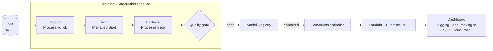

# Sepsis Early Warning System


An LSTM that reads a patient's hourly ICU vitals and labs and warns of sepsis
up to **6 hours before clinical onset**, built on the PhysioNet/CinC 2019
Challenge data and being moved to a production setup on AWS (SageMaker,
infrastructure as code).

Sepsis is a leading cause of death in hospitals, and each hour of delayed
treatment is associated with a 4–8% increase in mortality, so a reliable
early warning buys clinicians time to act.

## Results

Trained on one hospital (PhysioNet Set A) and evaluated **once** on a second,
unseen hospital (Set B: 20,000 patients, 1,142 septic):

| Metric (test, held-out hospital) | Served model (registry v1, trained by the pipeline) | Local training run |
|---|---|---|
| Official challenge utility score (1 = perfect, 0 = never alert) | **0.243** | 0.281 |
| AUROC | **0.774** | 0.778 |
| Septic patients warned in the 12 h before clinical onset | **67%** | 54% |
| Non-septic patients who ever receive an alert | 41% | 24% |
| Hours flagged | 16% | 11% |

Both models reached the same validation utility (0.361). The alert threshold
maximises the challenge's utility function on the validation split, trading
missed cases (heavily penalised) against false alarms; the two runs chose
slightly different thresholds, which explains most of the difference above,
and the drop from validation to test reflects the shift between hospitals.

## How the model was built

- **Task:** the official challenge formulation. At every hour, predict
  `SepsisLabel` using current and past data only. The dataset sets that label
  from 6 hours before Sepsis-3 onset, so a correct positive is a 6-hour warning.
- **Evaluation without leakage:** patient-level train/validation split of
  Set A; epochs, thresholds and alert tiers are chosen on validation only;
  Set B is scored once at the end.
- **Features:** 7 vitals, 6 labs, 4 demographics and 6 "lab was measured"
  flags. Missing values are forward-filled from earlier hours only (never
  from the future), then filled with training-set medians.
- **Imbalance** (1.8% positive hours): calibrated probabilities and
  utility-optimised thresholds, with no synthetic oversampling.
- **Explainability:** per-prediction SHAP contributions (in percentage points
  of risk) from the API.
- **Tests:** 31 pytest tests, including a check of the utility metric against
  the challenge's official scoring code.

> Version 2 of this project. The first version reported AUROC 0.78 / 80.9%
> sensitivity, but its evaluation used the test set for model selection,
> back-filled missing values from the future and applied SMOTE to time
> windows. Version 2 fixes all three; the numbers above are the honest ones.

## Architecture on AWS (in progress)



| Part | AWS services | Status |
|---|---|---|
| Foundation (storage, IAM, cost guardrails, CI access) | S3, IAM, AWS Budgets, IAM OIDC for GitHub Actions, via AWS CDK | ✅ Deployed |
| Training pipeline | SageMaker Pipelines, Processing (Managed Spot Training once quota allows) | ✅ Running |
| Model versioning and approval | SageMaker Model Registry | ✅ Running, manual approval |
| Serving | SageMaker Serverless Inference, Lambda Function URL | ✅ Running |
| Dashboard | S3 + CloudFront | Planned |
| Monitoring and CD | EventBridge, CloudWatch, GitHub Actions | Planned |

Design choices: region `ap-south-1` (Mumbai) for latency and data residency;
everything scales to zero when idle; infrastructure is defined in Python with
AWS CDK and checked by cdk-nag; GitHub Actions deploys through OIDC with no
stored AWS keys.

The pipeline runs Prepare, Train and Evaluate as SageMaker jobs from the raw
data in S3; Prepare is cached between runs. Runs that pass the quality gate
(test utility ≥ 0.20) register a new model version, which is deployed only
after manual approval. Training currently runs inside a Processing job
because the account has no training-job quota yet; a one-line switch
(`TRAINING_MODE` in `infra/pipeline/training_pipeline.py`) moves it to
Managed Spot Training.

Training is reproducible inside the pipeline (two runs produced the same
model), but results vary across environments: the local run and the pipeline
run reached the same validation utility (0.361) yet scored 0.281 and 0.243 on
the test hospital, mainly because the alert threshold chosen on validation
differs. Multi-seed evaluation is the planned next step.

The approved model is served from a SageMaker Serverless endpoint (scales to
zero; warm requests take about 0.3 s, and the first request after idle waits
25-70 s for a cold start). A Lambda Function URL provides the public API with
the same routes as the FastAPI service (`GET /health`, `POST /predict`). A
Function URL is used instead of API Gateway because the measured cold start
exceeds API Gateway HTTP APIs' 30-second limit. The Streamlit dashboard on
Hugging Face calls this API; the earlier Render deployment is being retired.

## Repository layout

```
src/sepsis/        ML package: features, labels, model, training, evaluation, utility metric, inference
api/               FastAPI service wrapping sepsis.inference
infra/             AWS CDK app (infra/app.py, infra/sepsis_infra/) and the SageMaker pipeline (infra/pipeline/)
tests/             pytest suite
models/production/ Current model bundle (weights, config, preprocessor, SHAP background)
reports/           Test evaluation (evaluation.json) and exploratory charts
notebooks/         Exploratory data analysis
dashboard/         Streamlit dashboard (to be replaced)
```

## Run locally

```bash
python -m venv venv
venv\Scripts\activate            # macOS/Linux: source venv/bin/activate
pip install torch --index-url https://download.pytorch.org/whl/cpu
pip install -e ".[api,test]"

# Data: download the PhysioNet 2019 training sets into data/raw/
python -m sepsis.prepare  --raw-dir data/raw --out-dir data/processed
python -m sepsis.train    --data-dir data/processed --model-dir models/production
python -m sepsis.evaluate --model-dir models/production --data-dir data/processed --out-dir reports

pytest
uvicorn api.main:app --reload    # http://localhost:8000/docs
```

## Deploy the AWS infrastructure

```bash
cd infra
python -m venv .venv && .venv\Scripts\activate
pip install -r requirements.txt && npm install
set BUDGET_EMAIL=you@example.com
npx cdk bootstrap                # once per account/region
npx cdk deploy
python -m pipeline.training_pipeline upsert   # create/update the SageMaker pipeline
python -m pipeline.training_pipeline start    # run it
```

## Data

[PhysioNet/Computing in Cardiology Challenge 2019](https://physionet.org/content/challenge-2019/):
40,336 ICU patients from two hospital systems, with hourly vital signs,
laboratory values and demographics.

## Author

Haadhi Mohammed · MSc Data Science (Distinction), Coventry University ·
AWS Certified Machine Learning Engineer – Associate ·
[LinkedIn](https://www.linkedin.com/in/haadhi-mohammed/)
