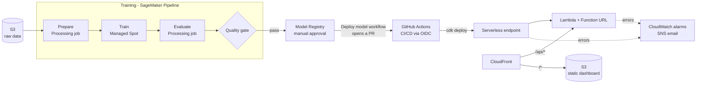

# Sepsis Early Warning System


An LSTM that reads a patient's hourly ICU vitals and labs and warns of sepsis
up to **6 hours before clinical onset**, built on the PhysioNet/CinC 2019
Challenge data and run as a production-style MLOps system on AWS: a SageMaker
training pipeline, a model registry with human approval, a serverless
endpoint, and infrastructure and deployments fully automated with AWS CDK and
GitHub Actions.

**Live demo:** https://d3j2opwsbr2bjy.cloudfront.net (the first prediction after
an idle spell takes up to a minute while the serverless model starts).

Sepsis is a leading cause of death in hospitals, and each hour of delayed
treatment is associated with a 4–8% increase in mortality, so a reliable
early warning buys clinicians time to act.

## Results

Trained on one hospital (PhysioNet Set A) and evaluated **once** on a second,
unseen hospital (Set B: 20,000 patients, 1,142 septic):

| Metric (test, held-out hospital) | Served model (registry v1, trained by the pipeline) | Local training run |
|---|---|---|
| Official challenge utility score (1 = perfect, 0 = never alert) | **0.243** | 0.281 |
| AUROC | **0.774** | 0.778 |
| Septic patients warned in the 12 h before clinical onset | **67%** | 54% |
| Non-septic patients who ever receive an alert | 41% | 24% |
| Hours flagged | 16% | 11% |

Both models reached the same validation utility (0.361). The alert threshold
maximises the challenge's utility function on the validation split, trading
missed cases (heavily penalised) against false alarms; the two runs chose
slightly different thresholds, which explains most of the difference above,
and the drop from validation to test reflects the shift between hospitals.

## How the model was built

- **Task:** the official challenge formulation. At every hour, predict
  `SepsisLabel` using current and past data only. The dataset sets that label
  from 6 hours before Sepsis-3 onset, so a correct positive is a 6-hour warning.
- **Evaluation without leakage:** patient-level train/validation split of
  Set A; epochs, thresholds and alert tiers are chosen on validation only;
  Set B is scored once at the end.
- **Features:** 7 vitals, 6 labs, 4 demographics and 6 "lab was measured"
  flags. Missing values are forward-filled from earlier hours only (never
  from the future), then filled with training-set medians.
- **Imbalance** (1.8% positive hours): calibrated probabilities and
  utility-optimised thresholds, with no synthetic oversampling.
- **Explainability:** per-prediction SHAP contributions (in percentage points
  of risk) from the API.
- **Tests:** 31 pytest tests, including a check of the utility metric against
  the challenge's official scoring code.

> Version 2 of this project. The first version reported AUROC 0.78 / 80.9%
> sensitivity, but its evaluation used the test set for model selection,
> back-filled missing values from the future and applied SMOTE to time
> windows. Version 2 fixes all three; the numbers above are the honest ones.

## Architecture on AWS



| Part | AWS services |
|---|---|
| Foundation: storage, IAM, cost guardrails, CI access | S3, IAM, AWS Budgets, IAM OIDC provider for GitHub Actions |
| Training pipeline | SageMaker Pipelines, Processing jobs, Managed Spot Training |
| Model versioning and approval | SageMaker Model Registry |
| Serving | SageMaker Serverless Inference, Lambda Function URL |
| Dashboard | S3 + CloudFront (Origin Access Control) |
| Deployment | AWS CDK (Python, checked by cdk-nag), GitHub Actions with OIDC |
| Monitoring | CloudWatch alarms, SNS email |

Region `ap-south-1` (Mumbai) for latency and data residency. Everything
scales to zero when idle: **the whole project, built and run over six weeks,
has cost under $1** (excluding credits), with an AWS Budget alerting at
$10/month.

### Training

The pipeline runs Prepare, Train and Evaluate as SageMaker jobs from the raw
data in S3. Steps are cached by a hash of their code, so unchanged steps are
skipped. Training runs on Managed Spot capacity: one run trained for 319 s
and was billed for 95 s (about 70% saved). Runs that pass the quality gate
(test utility ≥ 0.20) register a new model version as *Pending approval*,
with its evaluation metrics shown in SageMaker Studio.

Training is reproducible inside the pipeline: three runs, two in a Processing
job and one on Spot capacity on a different instance type, produced identical
test metrics. Results do vary across environments: the local run and the
pipeline run reached the same validation utility (0.361) yet scored 0.281
and 0.243 on the test hospital, mainly because the alert threshold chosen on
validation differs. Multi-seed evaluation is the natural next step.

### Serving

The approved model is served from a SageMaker Serverless endpoint (warm
requests take about 0.3 s; the first request after idle waits 15-70 s for a
cold start). A Lambda Function URL provides the public API (`GET /health`,
`POST /predict`); a Function URL rather than API Gateway because the cold
start exceeds API Gateway HTTP APIs' 30-second limit.

The dashboard is a static page in a private S3 bucket behind CloudFront.
CloudFront also routes `/api/*` to the Function URL, so page and API share
one HTTPS address with no CORS, and the page wakes the endpoint as soon as it
loads.

### Deployment and operations

- **CI/CD:** every pull request runs the tests. Every merge to `main` runs
  the tests, then `cdk deploy` and publishes the pipeline definition, using
  short-lived credentials from GitHub's OIDC token: no AWS keys are stored
  anywhere. The deploy role is limited to the CDK deployment roles and this
  one pipeline, and cannot start training or approve models.
- **Model promotion (GitOps):** after a version is approved in the registry,
  the *Deploy model* workflow packages it with the serving code and opens a
  pull request that changes the served version in `infra/cdk.json`. Merging
  it updates the endpoint without downtime; reverting it rolls back. Every
  production model change is a reviewed commit.
- **Monitoring:** CloudWatch alarms email (through SNS) when the API fails or
  times out, or when the endpoint returns server errors, and again when they
  recover. With real traffic, the next step would be SageMaker Model Monitor
  with data capture to detect drift in patient inputs.

## Repository layout

```
src/sepsis/          ML package: features, labels, model, training, evaluation, utility metric, inference
api/                 FastAPI service wrapping sepsis.inference (local development, Dockerfile)
infra/app.py         AWS CDK app
infra/sepsis_infra/  Stacks: foundation, serving, web
infra/pipeline/      SageMaker pipeline definition and job entry points
infra/serving/       Endpoint handler, API Lambda, model packaging for serving
infra/web/           Static dashboard
.github/workflows/   CI/CD and the Deploy model workflow
tests/               pytest suite
models/production/   Local model bundle (weights, config, preprocessor, SHAP background)
reports/             Test evaluation (evaluation.json) and exploratory charts
notebooks/           Exploratory data analysis
```

## Run locally

```bash
python -m venv venv
venv\Scripts\activate            # macOS/Linux: source venv/bin/activate
pip install torch --index-url https://download.pytorch.org/whl/cpu
pip install -e ".[api,test]"

# Data: download the PhysioNet 2019 training sets into data/raw/
python -m sepsis.prepare  --raw-dir data/raw --out-dir data/processed
python -m sepsis.train    --data-dir data/processed --model-dir models/production
python -m sepsis.evaluate --model-dir models/production --data-dir data/processed --out-dir reports

pytest
uvicorn api.main:app --reload    # http://localhost:8000/docs
```

## Deploy to your own AWS account

```bash
cd infra
python -m venv .venv && .venv\Scripts\activate
pip install -r requirements.txt && npm install
set BUDGET_EMAIL=you@example.com
npx cdk bootstrap                # once per account/region
npx cdk deploy SepsisFoundation
# upload the PhysioNet files to the data bucket under raw/, then:
python pipeline/training_pipeline.py upsert
python pipeline/training_pipeline.py start
# approve the registered version in SageMaker Studio, then:
python -m serving.package_model
npx cdk deploy --all
```

After the first deploy, set the repository variable `AWS_DEPLOY_ROLE_ARN`
(stack output `GitHubDeployRoleArn`) and the secret `BUDGET_EMAIL`, and
deployments run from GitHub Actions.

## Data

[PhysioNet/Computing in Cardiology Challenge 2019](https://physionet.org/content/challenge-2019/):
40,336 ICU patients from two hospital systems, with hourly vital signs,
laboratory values and demographics.

## Author

Haadhi Mohammed · MSc Data Science (Distinction), Coventry University ·
AWS Certified Machine Learning Engineer – Associate ·
[LinkedIn](https://www.linkedin.com/in/haadhi-mohammed/)
